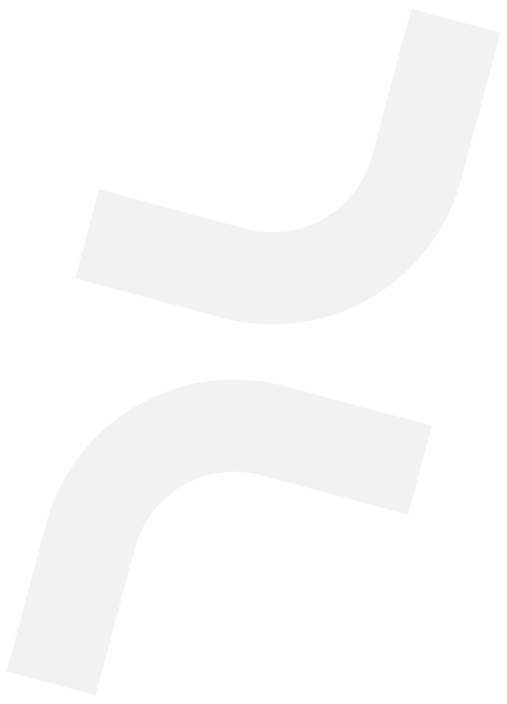

<div align="center" style="background-color: rgba(13, 9, 35, 0.9); backdrop-filter: blur(4px); box-shadow: 0 4px 6px rgba(0, 0, 0, 0.1); padding: 20px;">
  
</div>

<div align="center">
  <p align="center">
    <strong>Transformando ideas en soluciones digitales bajo el manto de la noche ✨</strong>
  </p>
</div>

## 🌙 Quiénes Somos

Nightly Software es una startup mexicana de tecnología que nace de la pasión por la innovación y el desarrollo de software. Como el cielo nocturno que inspira nuestro nombre, nos dedicamos a iluminar el camino hacia la transformación digital, convirtiendo ideas ambiciosas en soluciones tecnológicas brillantes.

## 💫 Nuestra Filosofía

En Nightly Software, creemos que la mejor innovación sucede cuando la creatividad se encuentra con la tecnología. Nuestro enfoque:

- 🌟 **Innovación Continua**: Como las fases de la luna, evolucionamos constantemente
- 🎯 **Soluciones Personalizadas**: Cada proyecto es único como una constelación
- 🤝 **Colaboración Transparente**: Clara como una noche estrellada
- 🚀 **Excelencia Técnica**: Impulsando el futuro del desarrollo de software

## 🛠️ Stack Tecnológico

Nuestras soluciones se construyen utilizando tecnologías modernas y robustas:

```javascript
const techStack = {
  frontend: ['React', 'Next.js', 'Three.js', 'TailwindCSS'],
  backend: ['Node.js', 'Python', 'SpringBoot'],
  cloud: ['AWS', 'Google Cloud', 'Azure'],
  ai: ['TensorFlow', 'OpenAI'],
  devOps: ['Docker', 'Kubernetes', 'CI/CD']
};
```

## 🌐 Áreas de Expertise

- **Desarrollo Web Avanzado**
- **Soluciones SaaS Empresariales**
- **Inteligencia Artificial y Machine Learning**
- **Integración de Sistemas y APIs**
- **Arquitectura Cloud Native**

## 🤝 Contribuye con Nosotros

Creemos en el poder del código abierto y la comunidad. Explora nuestros repositorios públicos y únete a nuestra misión de crear software excepcional.

## 📫 Conéctate con Nosotros

<div align="center">

[](mailto:jonathan@nightly.software)
[](https://www.instagram.com/nightlysoftware/)
[](https://www.facebook.com/nightlysoftware)
[](https://twitter.com/NightlySoftware)
[](https://www.linkedin.com/company/nightlysoftware)
[](https://github.com/NightlySoftware)
</div>

---

<div align="center">
  
  <div style="display: flex; align-items: center; justify-content: center;">
    <div style="height: 1px; width: 40px; background-color: rgba(125, 86, 131, 0.5);"></div>
    <p style="color: rgba(218, 223, 254, 0.7); font-size: 14px;">De noche, creamos el mañana</p>
    <div style="height: 1px; width: 40px; background-color: rgba(125, 86, 131, 0.5);"></div>
  </div>
</div>

<div align="center">
  <sub>Construido con 💜 por el equipo de NightlySoftware | © 2026 Todos los derechos reservados</sub>
</div>
